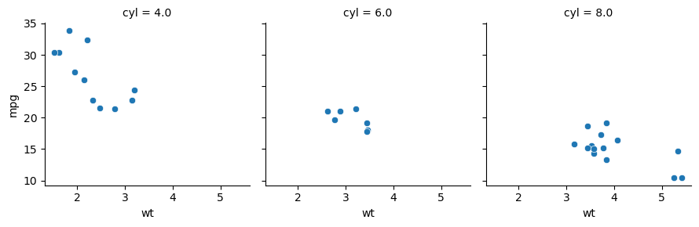

# ee283_week_4
# Pavan Nayak

## Output png image from python script



## Questions to Answer

 1) How do you delete all output from a snakemake work flow?
    
    rm $(snakemake --summary | tail -n+2 | cut -f1)
    
 2) How do you delete output from a single snakemake rule?
 
    There doesn't seem to be a command for this
    
 3) What is the citation for snakemake?
 
    Köster, Johannes and Rahmann, Sven. “Snakemake - A scalable bioinformatics workflow engine”. Bioinformatics 2012.
    
   
 ## Evidence of pipeline "robustness"
 
  "touching" R-db.r and re-running produces:
  
  ```
  Building DAG of jobs...
Provided cores: 1 (use --cores to define parallelism)
Rules claiming more threads will be scaled down.
Job counts:
        count   jobs
        1       Rdb
        1       all
        2

[Mon Feb  1 19:04:01 2021]
rule Rdb:
    input: R-db.r
    output: mtcars.sqlite3
    jobid: 1

Warning message:
package 'dbplyr' was built under R version 4.0.3
[Mon Feb  1 19:04:02 2021]
Finished job 1.
1 of 2 steps (50%) done

[Mon Feb  1 19:04:02 2021]
localrule all:
    input: mtcars.png, mtcars.sqlite3
    jobid: 0

[Mon Feb  1 19:04:02 2021]
Finished job 0.
2 of 2 steps (100%) done
Complete log: C:\Users\Pavan Nayak\Documents\UCI\Winter 2021 Q11\ECO_EVO_283\week4\.snakemake\log\2021-02-01T190401.244985.snakemake.log
  
  ```
  
 "touching" mtplot.py and re-running snakemake returns
 
 ```
 
 Building DAG of jobs...
Provided cores: 1 (use --cores to define parallelism)
Rules claiming more threads will be scaled down.
Job counts:
        count   jobs
        1       mtplot
        1

[Mon Feb  1 19:06:56 2021]
rule mtplot:
    input: mtcars.sqlite3
    output: mtcars.png
    jobid: 0

 
 ```
 
 "touching" mtcars.sqlite3 and re-running snakemake returns
 
 ```
 
 Building DAG of jobs...
Provided cores: 1 (use --cores to define parallelism)
Rules claiming more threads will be scaled down.
Job counts:
        count   jobs
        1       all
        1       mtplot
        2

[Mon Feb  1 19:08:25 2021]
rule mtplot:
    input: mtcars.sqlite3
    output: mtcars.png
    jobid: 1

[Mon Feb  1 19:08:27 2021]
Finished job 1.
1 of 2 steps (50%) done

[Mon Feb  1 19:08:27 2021]
localrule all:
    input: mtcars.png, mtcars.sqlite3
    jobid: 0

[Mon Feb  1 19:08:27 2021]
Finished job 0.
2 of 2 steps (100%) done
Complete log: C:\Users\Pavan Nayak\Documents\UCI\Winter 2021 Q11\ECO_EVO_283\week4\.snakemake\log\2021-02-01T190825.508079.snakemake.log
 
 ```
 
